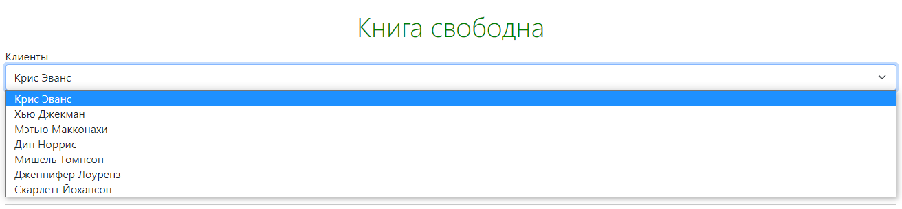
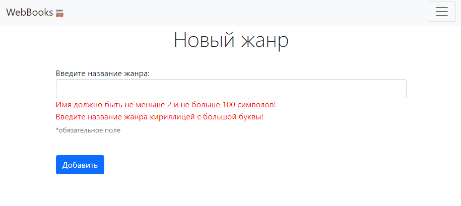

# WebBooks 📚
Веб-приложение для библиотечной логистики, система контроля всех этапов работы цифровой библиотеки (работа с позициями 
а складе, менеджмент клиентов и прочее)

## Содержание

- Реализованный функционал;
- Архитектура приложения
- Стек технологий

# Реализованный функционал

- [раздел "Жанры"](#genres);
- [раздел "Заказы"](#orders);

---

## Заказы

На странице книги, если книга свободна, появляется выпадающий список клиентов
и кнопка `Забронировать книгу`. Эта кнопка нажимается библиотекарем когда читатель хочет
забрать эту книгу. После нажатия на эту кнопку, книга
должна начинает принадлежать выбранному клиенту и пояевляется в его списке книг.

_Книга свободна_

_Книга занята_

Страница, на которой отображается **таблица клиентов и книг**, которые они взяли. Все записи в
таблице кликабельны и ведут на соответствующие страницы. Кнопка `Освободить` нажимается библиотекарем тогда, когда читатель
возвращает книгу обратно в библиотеку. После нажатия на кнопку книга снова
становится свободной, пропадает из списка взятых клиентом книг. 

---

## Жанры

1) **Страница со списком всех жанров**. Каждая строка кликабельна - при клике осуществляется переход на страницу жанра.
На странице расположена кнопка `Новый жанр` для создания нового жанра.

2) **Страница конкретного жанра**, на которой отображаются счетчик людей, добавивших данный
жанр в "свои любимые" и кликабельный список книг в библиотеке с данным жанром (книги, взятые клиентами
подсвечиваются красным цветом). Кнопки `Редактировать` и `Удалить жанр` перенаправляют на
соответствующие разделы

Если в библиотеке нет книг в данном жанре, вместо списка отображается
надпись _"Нет ни одной книги с этим жанром"_.

### Форма создания нового / редактирования существующего жанра. 

Поля валидируются с помощью `@Valid` и `Spring Validator` для отсутсвия повторяющихся записей

---

##

1) Страницы добавления, изменения и удаления книги, писателя, жанра и нового клиента, .

2) Страница со списком всех людей (люди кликабельные - при клике осуществляется
   переход на страницу человека).
4) Страница со списком всех книг (книги кликабельные - при клике осуществляется
   переход на страницу книги).
5) Страница человека, на которой показаны значения его полей и список книг, которые он
   взял. Если человек не взял ни одной книги, вместо списка должен быть текст "Человек
   пока не взял ни одной книги".
6) Страница книги, на которой показаны значения полей этой книги и имя человека,
   который взял эту книгу. Если эта книга не была никем взята, должен быть текст "Эта
   книга свободна".
7) На странице книги, если книга взята человеком, рядом с его именем должна быть кнопка
   "Освободить книгу". Эта кнопка нажимается библиотекарем тогда, когда читатель
   возвращает эту книгу обратно в библиотеку. После нажатия на эту кнопку книга снова
   становится свободно и пропадает из списка книг человека.
8) На странице книги, если книга свободна, должен быть выпадающий список (<select>)
   со всеми людьми и кнопка "Назначить книгу". Эта кнопка нажимается библиотекарем
   тогда, когда читатель хочет забрать эту книгу домой. После нажатия на эту кнопку, книга
   должна начать принадлежать выбранному человеку и должна появится в его списке
   книг.
9) Все поля должны валидироваться - с помощью @Valid и Spring Validator, если это
   требуется.

# TODO

## Главная страница

- Переходы по разделам
    - Клиенты
    - Жанры
    - Авторы
    - Книги
    - Букинг
- Страница с контактами библиотеки
- Возможность авторизации пользователей
- Роли
  - **гость** - просматривает книги и жанры
  - **пользователь** - предыдущее + просматривает собственную информацию
  - **редактор** - предыдущее + просматривает всех пользователей, записывает / снимает запись книг на пользователей
  - **старший редактор** - предыдущее + добавляет / редактирует / удаляет информацию
  - **администратор** - предыдушее + выдает роль "редактор", доступ к логам
- Логи
  - информация о входе / выходе пользователей
  - информация о действиях всех ролей
---

## Клиенты

- ✅ CRUD 
- Возможность загрузки фотографии
- ✅ Spring Validator
- Добавить поля
  - список взятых книг
  - количество взятых книг
  - ✅ адрес 
  - ✅ (уникальное) телефонный номер 
  - ✅ (опциональное) описание 
  - ✅ (опциональное) любимый жанр
- Возможность сортировки
  - по алфавиту (возрастание, убывание)
  - количеству взятых книг (возрастание, убывание)

---

## Жанры

- ✅ CRUD
- Возможность загрузки фотографии
- ✅ Spring Validator
- ✅ Количество пользователей, у которых данный жанр находится в избранном
- Просмотр пользователя, который взял больше всего книг в данном жанре
- ✅Список книг в данном жанре

## Авторы

- ✅ CRUD
- не работает редактирование
- Возможность загрузки фотографии
- ✅ Spring Validator
- ✅отбражение у каждого автора списка написанных книг

# Книги
- ✅ CRUD
- Возможность загрузки фотографии
- ✅ Spring Validator
- Страница книги, на которой показаны значения полей этой книги и имя человека,
  который взял эту книгу. Если эта книга не была никем взята, должен быть текст "Эта
  книга свободна".

<a href="https://www.flaticon.com/free-icons/book" title="book icons">Icons created by Good Ware - Flaticon</a>